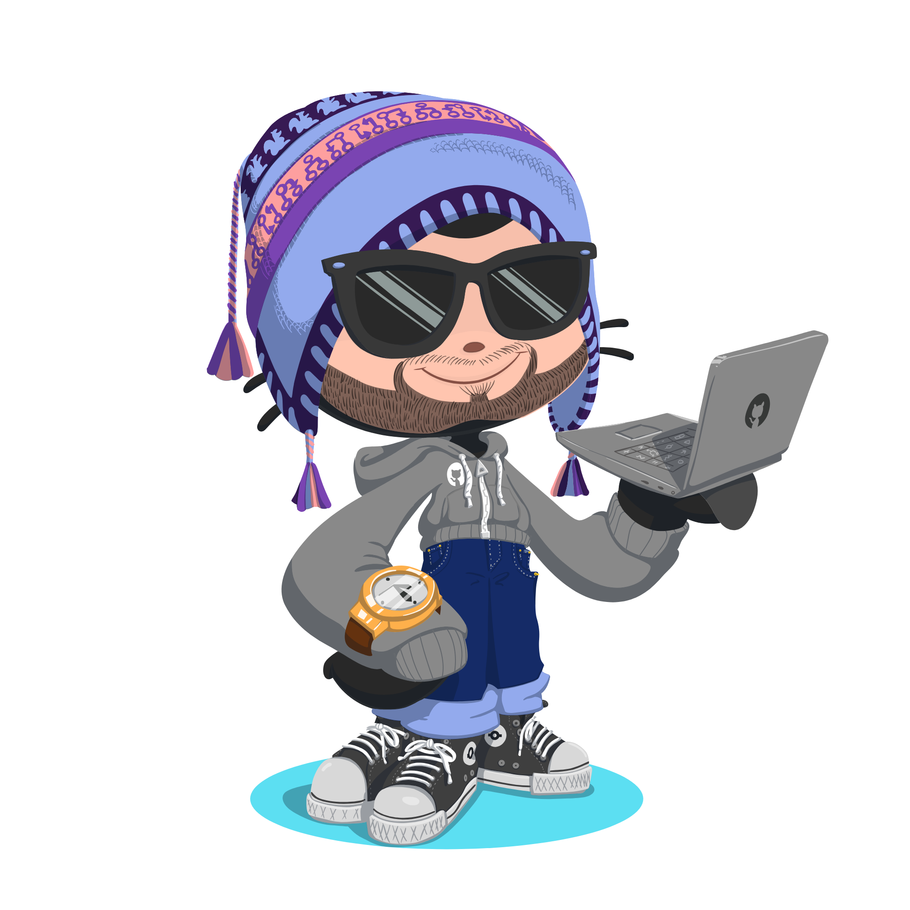

  

###

  
  

###

<h1 align="center">Hey, what´s up?</h1>

###

<h3 align="left">👩‍💻  About Me</h3>

###

I'm Mateus Leguir from Brazil  - 📚 I'm currently learning Python - ⚡ In my free time I make animation

###

<h3 align="left">🛠 Language and tools</h3>

###

  
  
  
  
  
  
  
  
  
  

###

  
